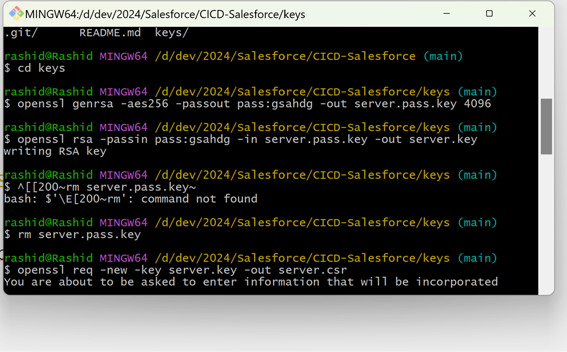
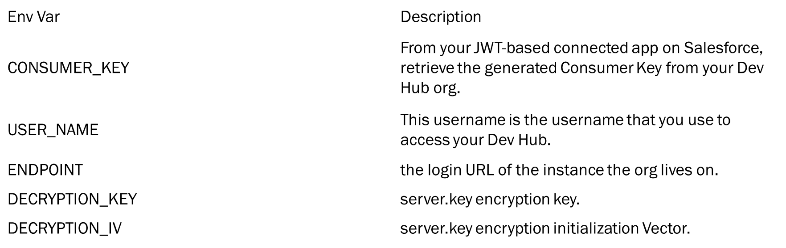

# CICD-Salesforce

GITLAB Salesforce (SFDC) CICD setup DevOps


## Getting started


Utilize any type of org, such as Sandbox, Production, or a free Developer Edition org.

Create GitLab account or use Existing one.

Create a new GitLab project or import our quick start . 

Configure CI/CD environment variables in your GitLab project. 

Software needed GIT, Salesforce CLI, OpenSSL





## Git Script

```
rashid@Rashid MINGW64 /d/dev/2024/Salesforce
$ git clone https://gitlab.com/sfdc7562228/CICD-Salesforce.git
Cloning into 'CICD-Salesforce'...
remote: Enumerating objects: 3, done.
remote: Counting objects: 100% (3/3), done.
remote: Compressing objects: 100% (2/2), done.
remote: Total 3 (delta 0), reused 0 (delta 0), pack-reused 0 (from 0)
Receiving objects: 100% (3/3), done.

rashid@Rashid MINGW64 /d/dev/2024/Salesforce
$ cd CICD-Salesforce/

rashid@Rashid MINGW64 /d/dev/2024/Salesforce/CICD-Salesforce (main)
$ mkdir keys

rashid@Rashid MINGW64 /d/dev/2024/Salesforce/CICD-Salesforce (main)
$ cd
.git/      README.md  keys/

rashid@Rashid MINGW64 /d/dev/2024/Salesforce/CICD-Salesforce (main)
$ cd
.git/      README.md  keys/

rashid@Rashid MINGW64 /d/dev/2024/Salesforce/CICD-Salesforce (main)
$ cd keys

rashid@Rashid MINGW64 /d/dev/2024/Salesforce/CICD-Salesforce/keys (main)
$ openssl genrsa -aes256 -passout pass:gsahdg -out server.pass.key 4096

rashid@Rashid MINGW64 /d/dev/2024/Salesforce/CICD-Salesforce/keys (main)
$ openssl rsa -passin pass:gsahdg -in server.pass.key -out server.key
writing RSA key

rashid@Rashid MINGW64 /d/dev/2024/Salesforce/CICD-Salesforce/keys (main)
$ ^[[200~rm server.pass.key~
bash: $'\E[200~rm': command not found

rashid@Rashid MINGW64 /d/dev/2024/Salesforce/CICD-Salesforce/keys (main)
$ rm server.pass.key

rashid@Rashid MINGW64 /d/dev/2024/Salesforce/CICD-Salesforce/keys (main)
$ openssl req -new -key server.key -out server.csr
You are about to be asked to enter information that will be incorporated
into your certificate request.
What you are about to enter is what is called a Distinguished Name or a DN.
There are quite a few fields but you can leave some blank
For some fields there will be a default value,
If you enter '.', the field will be left blank.
-----
Country Name (2 letter code) [AU]:IN
State or Province Name (full name) [Some-State]:Delhi
Locality Name (eg, city) []:New Delhi
Organization Name (eg, company) [Internet Widgits Pty Ltd]:SFDC
Organizational Unit Name (eg, section) []:SF
Common Name (e.g. server FQDN or YOUR name) []:SFDC
Email Address []:rashidahmad2135@gmail.com

Please enter the following 'extra' attributes
to be sent with your certificate request
A challenge password []:
An optional company name []:

rashid@Rashid MINGW64 /d/dev/2024/Salesforce/CICD-Salesforce/keys (main)
$ openssl x509 -req -sha256 -days 365 -in server.csr -signkey server.key -out server.crt
Certificate request self-signature ok
subject=C = IN, ST = Delhi, L = New Delhi, O = SFDC, OU = SF, CN = SFDC, emailAddress = rashidahmad2135@gmail.com

rashid@Rashid MINGW64 /d/dev/2024/Salesforce/CICD-Salesforce/keys (main)
$ sfdx force:auth:jwt:grant --client-id 3MVG9n_HvETGhr3BkBFXO8q5GHB7U8RlSY9XmPg4OtX6_qnEEtMNq6EPuy3iBkaodNu7RqZToHmq_bUe5964v -f server.key --username rashidahmad03@abc.com -a cicdorg --instance-url https://rashidabc-dev-ed.my.salesforce.com/
 »   Warning: @salesforce/cli update available from 2.25.7 to 2.48.6.
Successfully authorized rashidahmad03@abc.com with org ID 00D2w000006ZBV7EAO

rashid@Rashid MINGW64 /d/dev/2024/Salesforce/CICD-Salesforce/keys (main)
$ openssl enc -aes-256-cbc -k AppPassword1 -P -md sha1 -nosalt
*** WARNING : deprecated key derivation used.
Using -iter or -pbkdf2 would be better.
key=C8A5768564AA5554750E3C7C3C1592CD4558B1A2AF452B66BD061B0EC29BAFC1
iv =6273446D363499B16912376710681BDD


rashid@Rashid MINGW64 /d/dev/2024/Salesforce/CICD-Salesforce/keys (main)
$ openssl enc -nosalt -aes-256-cbc -in server.key -out server.key.enc -base64 -K C8A5768564AA5554750E3C7C3C1592CD4558B1A2AF452B66BD061B0EC29BAFC1 -iv 6273446D363499B16912376710681BDD

rashid@Rashid MINGW64 /d/dev/2024/Salesforce/CICD-Salesforce/keys (main)
$

```

## Environment Variables



## Here are some helpful links that can assist you in understanding

https://devcenter.heroku.com/articles/ssl-certificate-self
https://developer.salesforce.com/docs/atlas.en-us.sfdx_dev.meta/sfdx_dev/sfdx_dev_auth_key_and_cert.htm
https://developer.salesforce.com/docs/atlas.en-us.sfdx_dev.meta/sfdx_dev/sfdx_dev_auth_connected_app.htm
https://developer.salesforce.com/docs/atlas.en-us.sfdx_dev.meta/sfdx_dev/sfdx_dev_intro.htm


